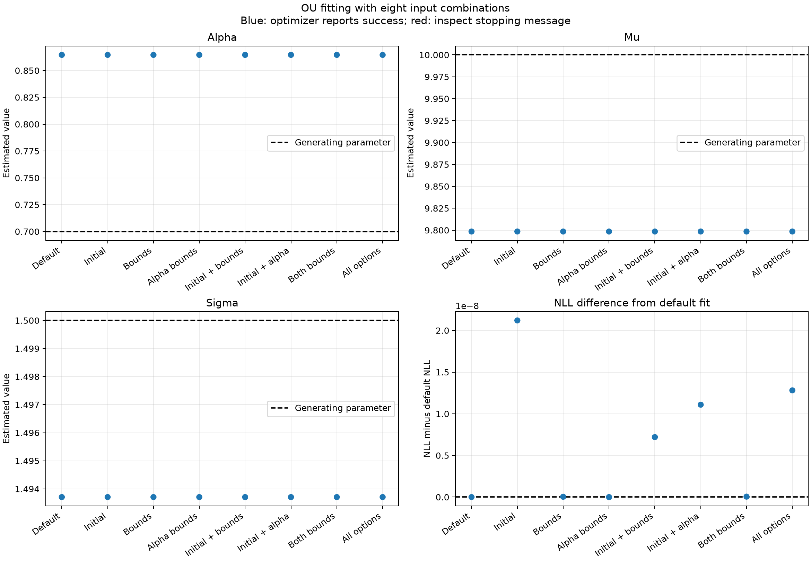
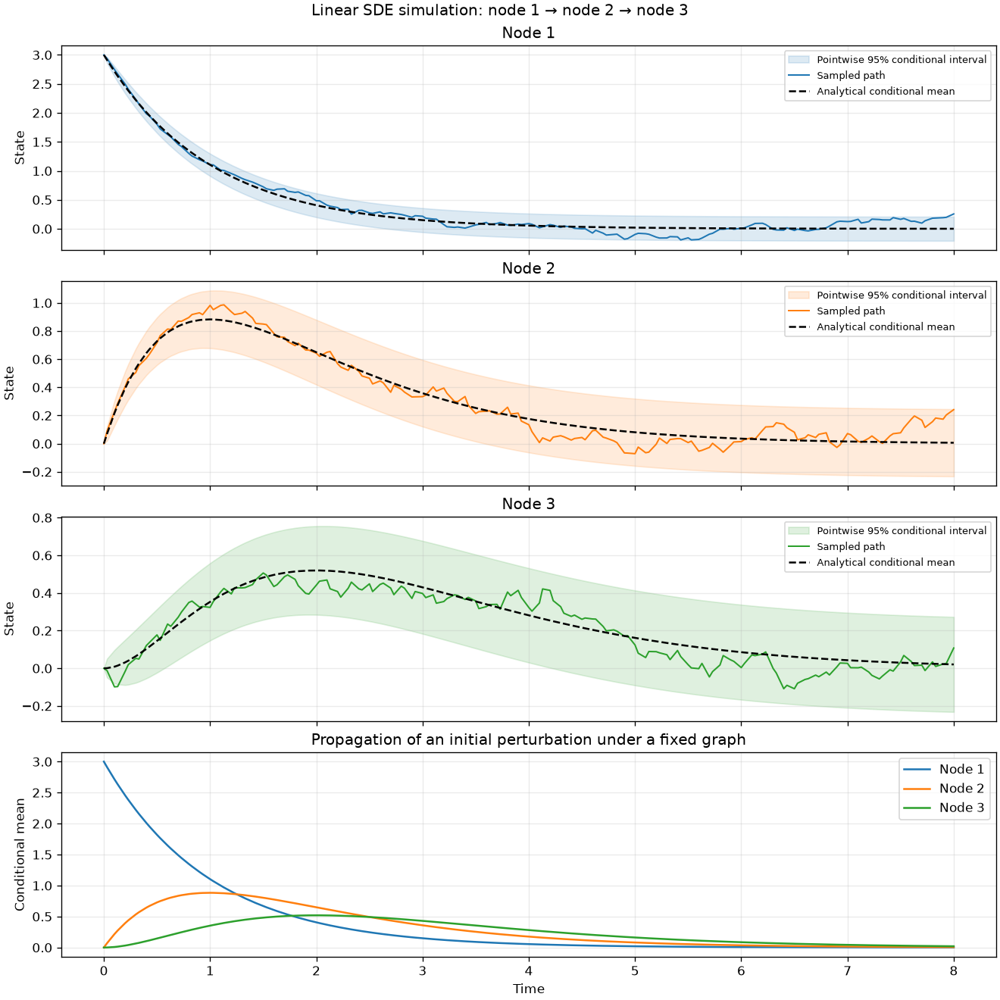
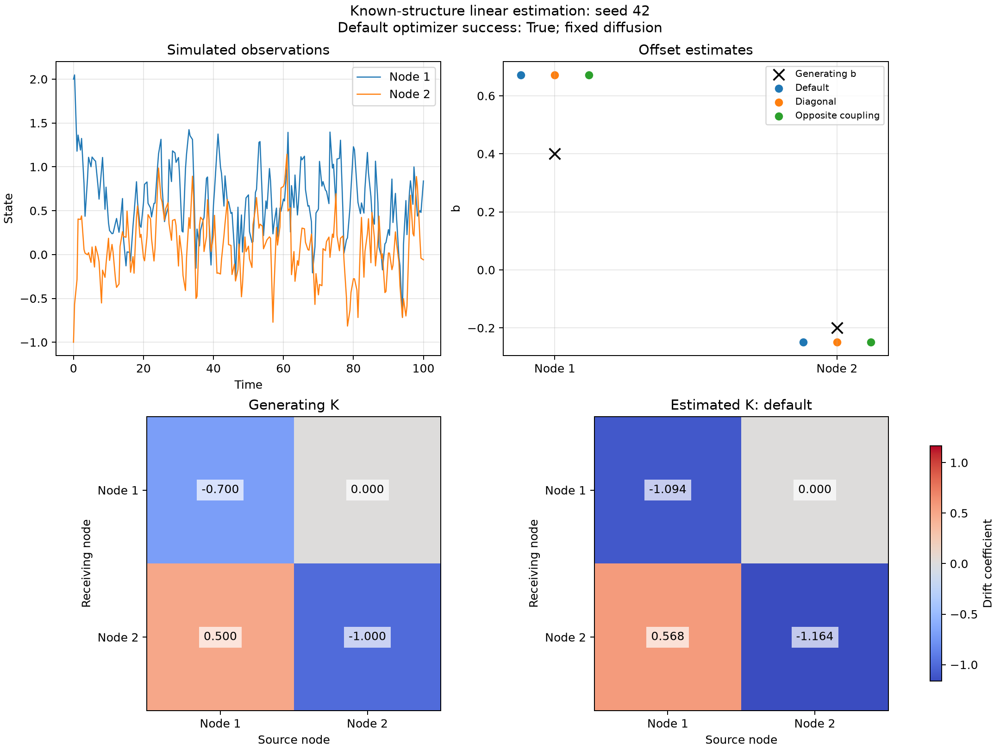
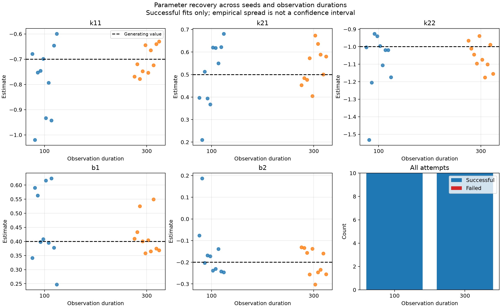

# Experiment Record

This document records reproducible examples, numerical observations, and their limits. Experiments complement automated tests; successful execution or an attractive plot is not a proof of estimator accuracy. Under the [relationship definition](DEVELOPMENT_PLAN.md#appendix-e-relationship-definitions-and-result-contract), these examples evaluate specified numerical descriptors, not semantic relation categories. Distinguish computed values, imposed structure, and evidence for reproducible patterns.

## Reproduction baseline

Recorded on 2026-10-05 against commit `0b159cb` (`v027`). All eight scripts below were rerun successfully with the non-interactive Matplotlib Agg backend. Environment: Python 3.12.14, NumPy 2.5.3, SciPy 1.18.1, Matplotlib 3.11.2. No implementation or test files were changed for this record. This run did not rerun the full pytest suite.

The linear estimation record in section 6 was separately rerun on 2026-10-08 against implementation commit `cc38b23` (v032), with the experiment script included in this documentation update. The full suite passed: **326 tests**. Environment versions were unchanged.

Activate the project's virtual environment and run commands from the repository root. Omit `MPLBACKEND=Agg` to open plot windows; prepend it for headless execution. The numbers below are representative results, not portable exact-output assertions: library versions and numerical solvers can affect the final digits.

| Experiment | Command | Purpose |
| --- | --- | --- |
| Brownian bridge | `python -m experiments.experiment_brownian_bridge` | Trace conditional path construction at irregular times. |
| OU simulation | `python -m experiments.experiment_ou` | Compare a sampled path with analytical conditional moments. |
| OU estimation | `python -m experiments.experiment_ou_estimation` | Fit parameters and inspect in-sample residuals. |
| OU profile | `python -m experiments.experiment_ou_profile` | Compare profile/joint fits and supplied search ranges. |
| OU interface | `python -m experiments.experiment_ou_interface` | Compare eight optional-input combinations. |
| Small-alpha boundary | `python -m experiments.experiment_ou_brownian_limit` | Compare the profiled OU limit with drifted Brownian motion. |
| Large-alpha boundary | `python -m experiments.experiment_ou_large_alpha_limit` | Compare the profiled OU limit with independent Gaussian targets. |
| Coupled linear simulation | `python -m experiments.experiment_linear` | Show propagation and compare sampled transition moments with theory. |
| Known-structure linear estimation | `python -m experiments.experiment_linear_estimation` | Compare three starts and coefficient recovery with fixed diffusion and a supplied mask. |

## 1. Brownian bridge and OU simulation

### Brownian bridge

**Setup:** endpoints `(t, X) = (0, 2)` and `(10, 8)`, volatility 1.5, seed 42, and 25 irregular interior times listed in the script.

**Reference:** the conditional mean interpolates between the endpoints; the component variance is `sigma**2 * (t - t_L) * (t_R - t) / (t_R - t_L)`.

**Observed result:** the construction trace completed all 25 interior points. At time 0.20, the mean was 2.1200 and the sample 1.6208; at time 9.75, the mean was 7.8500 and the sample 7.9418.

**Interpretation and limits:** this illustrates a joint conditional draw given endpoints. It does not recover an actual hidden path or estimate volatility. The trace describes interval selection, not a learned graph.

### OU simulation

**Setup:** initial value 14 at time zero, alpha 0.7, mu 10, sigma 1.5, seed 42, and 22 irregular observations through time 10.

**Reference:** the conditional mean is `mu + exp(-alpha*t) * (x0 - mu)` and the conditional variance is `sigma**2 * (1 - exp(-2*alpha*t)) / (2*alpha)`.

**Observed result:** at time 10, the mean was 10.0036, variance 1.6071, and sampled state 10.0268. The limiting variance is approximately 1.607143.

**Interpretation and limits:** individual paths fluctuate around the mean; they need not converge to it. The displayed 95% bands are pointwise conditional state intervals under fixed parameters, not parameter intervals or simultaneous path coverage. Plot segments between sampled times are display connections.

## 2. Scalar OU parameter estimation

The estimation, profile, interface, and boundary experiments use the same generating setup: initial value 14, `(alpha, mu, sigma) = (0.7, 10, 1.5)`, seed 42, and alternating intervals 0.05 and 0.15 repeated 500 times. This gives 1001 observations over duration 100. Reusing this trajectory supports comparisons, not independent replication.

**Objective:** fit the conditional likelihood and inspect residuals. The joint fit uses bounds `(0.001, 5)`, `(-20, 20)`, and `(0.01, 10)` for alpha, mu, and sigma respectively.

| Parameter | Generating value | Initial value | Estimate |
| --- | ---: | ---: | ---: |
| alpha | 0.7000 | 0.0100 | 0.8646 |
| mu | 10.0000 | 9.8257 | 9.7985 |
| sigma | 1.5000 | 1.4641 | 1.4937 |

Initial NLL: **576.458470**. Final NLL: **554.534748**. The optimizer reported success, and none of the three estimates was near a supplied boundary. In-sample standardized residual mean: **0.0006**; variance: **1.0000** (rounded).

**Interpretation and limits:** fitting improves the likelihood of this realized sample. The estimate need not equal the generating parameters. Residual moments near zero and one are partly tied to fitting on the same observations; they do not establish normality, independence, or out-of-sample validity. New paths generated under fitted parameters are simulations, not reconstructions of the observed path, and hold parameter uncertainty fixed.

## 3. Profile search, interfaces, and boundary limits

### Profile versus joint fitting

**Objective:** compare two numerical fitting routes and demonstrate the effect of restrictive alpha bounds.

| Alpha bounds | Estimated alpha | NLL | Near upper bound |
| --- | ---: | ---: | --- |
| (0.01, 0.3) | 0.300000 | 563.93915278 | Yes |
| (0.01, 5.0) | 0.864584 | 554.53474842 | No |
| (0.001, 10.0) | 0.864584 | 554.53474842 | No |

The displayed profile/joint comparison uses alpha bounds `(0.001, 5.0)`. Both fits gave NLL **554.53474842**, with absolute difference approximately **3.91e-11**. The best displayed grid score was **554.53540261**.

**Interpretation and limits:** the narrow range excludes the better interior candidate found in wider ranges. Agreement between profile and joint fits on this sample is useful cross-checking, not a global-optimality theorem. Joint fitting also restricts mu and sigma; profile fitting does not impose those bounds.

### Public interface combinations

**Objective:** exercise all eight combinations of optional initial parameters, full parameter bounds, and alpha bounds.

| Case | Route | NLL difference from default |
| --- | --- | ---: |
| Default | profile | 0.0000000000 |
| Initial | joint | 0.0000000212 |
| Bounds | joint | 0.0000000000 |
| Alpha bounds | profile | 0.0000000000 |
| Initial + bounds | joint | 0.0000000072 |
| Initial + alpha | joint | 0.0000000111 |
| Both bounds | joint | 0.0000000001 |
| All options | joint | 0.0000000128 |

All eight reported success and estimates near `(0.86458, 9.79848, 1.49371)`. The largest printed NLL difference was approximately **2.12e-8**. Exact input choices are in the linked [script](../experiments/experiment_ou_interface.py).



Recreate the interface image with:

```bash
MPLBACKEND=Agg python -m experiments.experiment_ou_interface --no-show --save docs/images/ou_interface.png
```

**Limit:** interface consistency does not measure statistical recovery accuracy. The dashed generating values and fitted values differ because the fit uses one finite random sample.

### Small-alpha boundary

**Reference:** as alpha tends to zero along the profiled estimates, compare `alpha * mu` with a Brownian drift estimate, rather than expecting mu itself to remain finite.

The Brownian fit gave drift **-0.02032881**, sigma **1.46411377**, and NLL **576.97559191**.

| alpha | Profile mu | alpha * mu | Profile sigma | OU NLL minus boundary NLL |
| --- | ---: | ---: | ---: | ---: |
| 1e-3 | -10.506794 | -0.01050679 | 1.46410942 | -0.05296636 |
| 1e-6 | -20318.990135 | -0.02031899 | 1.46411376 | -0.00005300 |

**Interpretation and limits:** the effective drift, noise scale, and score approach the Brownian boundary while mu becomes large in magnitude. This is a boundary diagnostic, not evidence that this trajectory is best modeled as Brownian motion; the interior OU score is lower.

### Large-alpha boundary

**Reference:** for fixed positive observation gaps, compare the profile limit with an independent Gaussian fit to `values[1:]`, consistent with conditioning on the initial state. Refit mu and sigma as alpha changes; this is not a fixed-sigma limit.

The Gaussian boundary mean was **9.82151007**, variance **1.36176261**, and NLL **1573.32848057**.

| alpha | Profile mu | Profile sigma | sigma squared / (2 alpha) | OU NLL minus boundary NLL |
| --- | ---: | ---: | ---: | ---: |
| 100 | 9.82149637 | 16.44950034 | 1.35293031 | -3.26487886 |
| 300 | 9.82151007 | 28.58421455 | 1.36176220 | -0.00014826 |

**Interpretation and limits:** mu, the stationary variance combination, and the score approach the independent Gaussian reference. Sigma itself grows. This checks a likelihood boundary, not the quality of independent sampling as a model for the data.

## 4. Coupled linear SDE simulation

**Objective:** check a supplied directed chain and visualize the response to an initial perturbation. The graph is given, not inferred.

**Setup:**

```text
K = [[-1.0,  0.0,  0.0],
     [ 0.8, -1.0,  0.0],
     [ 0.0,  0.8, -1.0]]
b = [0, 0, 0]
B = 0.15 * I
X(0) = [3, 0, 0]
```

`K[i,j]` acts from j to i, so the direct chain is **1 -> 2 -> 3**. Alternate intervals 0.03 and 0.07 for 80 pairs: 161 observations over duration 8. The path uses seed 42. The separate 5000-draw moment experiment also initializes its own generator with seed 42 and always starts from the same initial state, sampling at elapsed time 2.

**Reference:** the analytical conditional means are `3*exp(-t)`, `2.4*t*exp(-t)`, and `0.96*t**2*exp(-t)`. Nodes 2 and 3 reach their mean peaks at times 1 and 2. This is a delayed peak response, not a strict finite propagation delay. The theoretical covariance is computed by `linear_transition`; the moment check therefore checks sampler consistency, while separate analytical transition tests are needed for independent verification.

| Node | Theoretical mean at time 2 | Sample mean |
| --- | ---: | ---: |
| 1 | 0.406006 | 0.403853 |
| 2 | 0.649609 | 0.646589 |
| 3 | 0.519687 | 0.516149 |

Theoretical covariance:

```text
[[0.01104395, 0.00408790, 0.00137141],
 [0.00408790, 0.01378678, 0.00531160],
 [0.00137141, 0.00531160, 0.01442815]]
```

Sample covariance:

```text
[[0.01096779, 0.00383780, 0.00124955],
 [0.00383780, 0.01369868, 0.00542189],
 [0.00124955, 0.00542189, 0.01482047]]
```

Maximum absolute covariance difference: **0.0003923183771658671**. The mean discrepancies are approximately 1.45, 1.82, and 2.08 theoretical Monte Carlo standard errors, using `sqrt(Q[i,i] / 5000)`.



The figure was exported from the existing script without changing its source. To regenerate it headlessly:

```bash
MPLBACKEND=Agg python - <<'PY'
from pathlib import Path
import matplotlib.pyplot as plt
from experiments.experiment_linear import main

plt.show = lambda: None
main()
Path("docs/images").mkdir(parents=True, exist_ok=True)
plt.gcf().savefig("docs/images/linear.png", dpi=120)
plt.close("all")
PY
```

**Interpretation and limits:** sampled moments are close to the fixed-model reference in this run. Nodes 1 and 3 have nonzero covariance without a direct connecting drift coefficient, illustrating indirect propagation. The graph remains fixed while states evolve. The shaded bands describe pointwise process uncertainty, not uncertainty about graph edges. This experiment does not establish unknown-graph recovery, change detection, or repeated-seed performance.

## 6. Linear parameter estimation under a supplied mask

**Objective:** estimate K and b from complete observations with B fixed and permitted drift entries supplied. This is parameter estimation under structural restrictions, not unknown-edge selection.

**Reproduce:**

```bash
MPLBACKEND=Agg python -m experiments.experiment_linear_estimation
```

The script saves the reference and recovery figures plus three CSV files under `experiments/outputs/`. Without `MPLBACKEND=Agg`, it also opens plot windows. The updated script skips `show()` with the Agg backend.

**Setup:**

```text
K = [[-0.7, 0.0], [0.5, -1.0]]
b = [0.4, -0.2]
B = diag([0.6, 0.5])
X(0) = [2.0, -1.0]
mask = [[True, False], [True, True]]
```

Alternate intervals 0.3 and 0.7 for 100 pairs: 201 observations over duration 100, generated with seed 42. Fit the same trajectory three times: default start, diagonal start `[[-0.4,0],[0,-0.4]]`, and opposite-coupling start `[[-1.5,0],[-0.4,-1.2]]`. No true drift or offset is passed as an initial guess. Each run uses a maximum of 150 Powell iterations; b is profiled by weighted least squares.

| Start | Initial NLL | Final NLL | Optimizer success | Stable fitted drift |
| --- | ---: | ---: | --- | --- |
| Default | 130.348312 | 70.395596 | True | True |
| Diagonal | 97.818046 | 70.395596 | True | True |
| Opposite coupling | 96.013542 | 70.395596 | True | True |

Default-fit coefficients:

| Parameter | Generating value | Estimate |
| --- | ---: | ---: |
| K[0,0] | -0.70000000 | -1.09433391 |
| K[0,1] | 0.00000000 | 0.00000000 (fixed by mask) |
| K[1,0] | 0.50000000 | 0.56805819 |
| K[1,1] | -1.00000000 | -1.16426933 |
| b[0] | 0.40000000 | 0.67192115 |
| b[1] | -0.20000000 | -0.24929453 |

NLL at the generating parameters is **74.59130110**. The default fit has drift Frobenius error **0.43256856**, offset Euclidean error **0.27635315**, and spectral abscissa **-1.09433391**. All three runs report zero invalid trial evaluations. The largest drift difference from the default among these starts is approximately **7.79e-6**.



**Interpretation:** these three starts reach nearly identical finite candidates on this dataset. This supports local initialization robustness in this example, not global optimality. Fitted NLL can be lower than NLL at the generating parameters because maximum likelihood adapts to a finite sample. Some coefficient errors remain substantial; agreement between optimizers is not evidence of accurate recovery. The zero coefficient is enforced, not discovered. The heatmaps include diagonal self-dynamics and are not graph adjacency matrices.

**Reference limits:** the three-start comparison uses one trajectory. It assesses numerical initialization sensitivity, not repeated-sample accuracy. The extension below evaluates the latter under the same supplied structure and fixed diffusion.

### Repeated seeds and observation durations

**Evidence:** user execution on 2026-10-08, after adding summary self-checks to the working experiment based on v033 (`9a3ac1e`). The saved CSV files were inspected for this record. This documentation update did not rerun all 23 fits or the full test suite. The previous 326-test result belongs to the earlier implementation validation, not a new test run.

**Design:** preserve the seed-42 reference and add seeds 0–9 at durations 100 and 300, with alternating intervals 0.3/0.7. This gives 201 and 601 observations respectively. All 20 repeated fits use the default initialization, fixed generating B, the same supplied mask, and a 150-iteration limit. Paired seeds extend the same simulated path at the longer duration under the current simulator; comparisons across durations are therefore dependent. The complete script performs 23 fits.

Before fitting, `_check_summary` verifies hand-calculated mean/bias/RMSE, failure counting and exclusion, and unavailable statistics when no fit succeeds. These lightweight checks run inside the experiment; they are not additional pytest cases.

| Duration | Observations | Attempts | Successful | Failed | Mean seconds per attempt |
| --- | ---: | ---: | ---: | ---: | ---: |
| 100 | 201 | 10 | 10 | 0 | 2.60 |
| 300 | 601 | 10 | 10 | 0 | 8.69 |

The following statistics use successful fits only; the denominator is 10 at each duration in this run. Bias is the mean signed error; RMSE is the square root of the mean squared error. Failed finite candidates remain in the raw records but are excluded from these accuracy statistics; an all-failed condition reports unavailable values, not zero error.

| Parameter | Mean, T=100 | Bias, T=100 | RMSE, T=100 | Mean, T=300 | Bias, T=300 | RMSE, T=300 |
| --- | ---: | ---: | ---: | ---: | ---: | ---: |
| k11 | -0.780963 | -0.080963 | 0.155651 | -0.706986 | -0.006986 | 0.054599 |
| k21 | 0.497283 | -0.002717 | 0.142189 | 0.537080 | 0.037080 | 0.089588 |
| k22 | -1.091800 | -0.091800 | 0.194041 | -1.055035 | -0.055035 | 0.093237 |
| b1 | 0.456059 | 0.056059 | 0.136761 | 0.418903 | 0.018903 | 0.066115 |
| b2 | -0.152806 | 0.047194 | 0.133066 | -0.201148 | -0.001148 | 0.060616 |



**Interpretation:** all five empirical RMSEs decrease with longer observation duration in this run. The absolute empirical bias of k21 increases while its RMSE decreases: signed errors can cancel, so a small bias alone does not establish accurate individual estimates. Runtime is machine/load dependent; these two measurements do not establish general complexity. Total NLLs across different data lengths are not directly comparable as measures of fit quality.

**Saved artifacts:**

- [Reference records](../experiments/outputs/linear_estimation_reference.csv): three initializations on seed 42.
- [All repeated attempts](../experiments/outputs/linear_estimation_runs.csv): per-run parameters, scores, timing, status, and failure messages; saved after each attempt.
- [Summary statistics](../experiments/outputs/linear_estimation_summary.csv): per-duration counts, bias, RMSE, and median errors.
- [Reference figure](../experiments/outputs/linear_estimation.png) and [recovery figure](../experiments/outputs/linear_estimation_recovery.png).

**Scope and next step:** this completes the initial repeated-seed/duration check for the known-structure baseline. Ten seeds do not establish estimator consistency, universal success, or calibrated intervals. The model is correctly specified, observations are complete/exact, B is known, and one forbidden coefficient is imposed by the mask. Unknown-edge selection, missing observations, and changing relationships are not evaluated. Proceed to the optional-mask interface; retain the planned no-edge controls, prediction evaluation, and estimated-noise checks.

## Updating this record

When adding a result, record the source revision, environment, command, data-generating setup, seed, reference, key measurements, and limitations. Update representative figures when the underlying experiment changes. Keep raw debugging output out of the narrative. Future graph experiments should measure false and missed edges and stability; future change experiments should also measure false alarms and detection delay. Do not infer those capabilities from the simulation results above.
